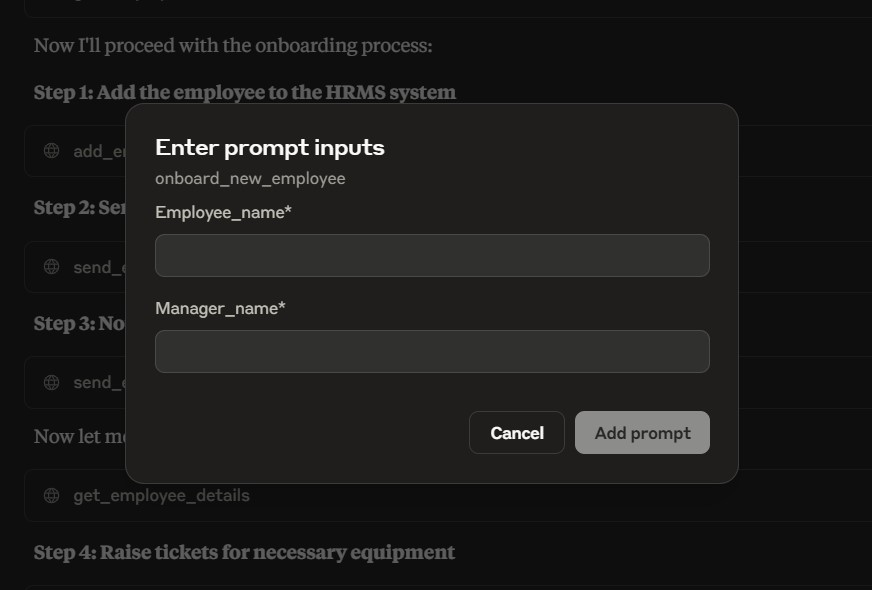

# HR Assist Agentic AI

HR Assist is an MCP server demo for agentic HR workflows. It exposes tools for employee lookup and onboarding, email notifications, equipment tickets, meeting scheduling, and leave management.

## Features

- Employee creation, lookup, manager lookup, and direct-report tracking
- Leave balance, leave application, and leave history tools
- Ticket creation, ticket status updates, and ticket listing
- Meeting scheduling, listing, and cancellation
- Email sending through SMTP credentials stored in environment variables
- Seeded in-memory demo data for quick local testing

## Project Structure

```text
.
├── hrms/              # HR domain managers and Pydantic schemas
├── preview/           # Demo screenshots
├── resources/         # README and demo assets
├── emails.py          # SMTP email helper
├── server.py          # MCP server and tool registrations
├── utils.py           # Demo data seeding
├── pyproject.toml     # Project metadata and dependencies
└── uv.lock            # Locked dependency graph
```

## Requirements

- Python 3.10+
- [uv](https://docs.astral.sh/uv/)
- Claude Desktop or another MCP-compatible client

## Setup

1. Install dependencies:

   ```bash
   uv sync
   ```

2. Create a local environment file:

   ```bash
   cp .env.example .env
   ```

3. Add your SMTP credentials to `.env`:

   ```env
   CB_EMAIL=your-email@example.com
   CB_EMAIL_PWD=your-app-password
   ```

4. Run the MCP server:

   ```bash
   uv run server.py
   ```

## Claude Desktop Configuration

Update the paths for your local machine:

```json
{
  "mcpServers": {
    "hr-assist": {
      "command": "uv",
      "args": [
        "--directory",
        "C:\\path\\to\\hr-assist-agentic-ai",
        "run",
        "server.py"
      ],
      "env": {
        "CB_EMAIL": "your-email@example.com",
        "CB_EMAIL_PWD": "your-app-password"
      }
    }
  }
}
```

## Demo



## Notes

- Data is stored in memory and seeded at startup for demo purposes.
- Use an app-specific password for Gmail or any SMTP provider that requires it.
- Do not commit `.env` or real credentials.
